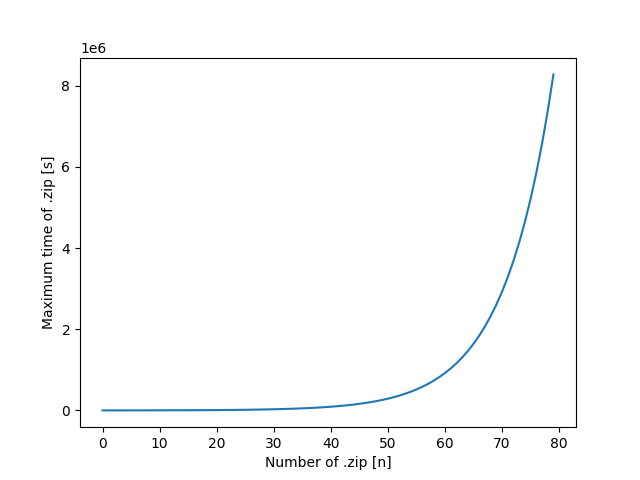

# backup_project

Simple class used for performing backup of folder on disk.
Folder is stored as .zip. Over time new .zip is also added and old .zip are
removed. Most commonly used for local database backup.

# How to run
This program require python3.5+ installed on your system.
1) Clone repo
``` bash
$ git clone https://github.com/BojanFaletic/backup_project --depth 1
```


2) Change folder to folder you would like to backup
``` python
    if __name__ == "__main__":
        backup_folder = 'name of folder'
        b = Backup(backup_folder)
        b.handle_backup()
```

3) Run

``` bash
$ python backup.py &
```

# Description
Number of of files is calculated with this function.
``` python
    # determine how many files can exist by interval
    def get_interval_seconds(self, n=6, total_size=80):
        start = 15
        elements = [int(start*60*(2**(x/n))) for x in range(total_size)]
        return elements
```


